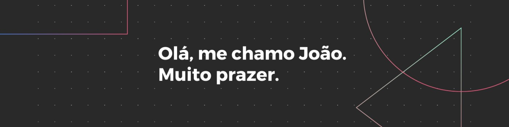

&nbsp;&nbsp;&nbsp;

### 👨‍💻💡 Amante da Programação e Tecnologia 👩‍💻🚀

Entusiasta de tecnologia e programação. Atualmente estudante de Análise e Desenvolvimento de Sistemas.

 

 &nbsp;
 &nbsp;

## Skills

#### Tecnologias

&nbsp;
&nbsp;

&nbsp;
&nbsp;
&nbsp;
&nbsp;

&nbsp;

#### Estudando neste momento

#### Ferramentas

&nbsp;

&nbsp;

&nbsp;
&nbsp;

## Social Media

<!-- Instagram -->

<!-- Linkdin -->

<!-- Youtube -->

<!-- Twitch -->

&nbsp;&nbsp;

&nbsp;&nbsp;  

